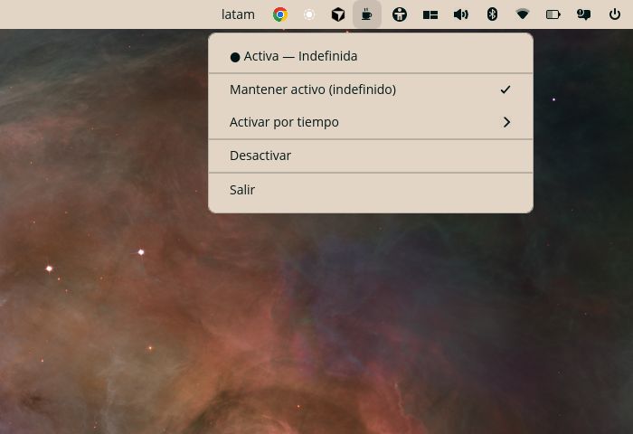

<div align="center">

# ☕ Caffeine for COSMIC

**Mantén tu pantalla despierta desde el panel de COSMIC™.**

Un indicador ligero (estilo *Amphetamine* / *Caffeine*) para el escritorio **COSMIC** de
Pop!_OS que evita que la pantalla se apague o el equipo se suspenda por inactividad,
con un solo clic desde la bandeja del sistema.

[](LICENSE)
[](https://www.rust-lang.org/)
[](https://system76.com/cosmic)
[](#-instalación)

<!-- Sustituye por una captura real una vez tomada (también necesaria para Flathub) -->


</div>

---

## ✨ Características

- **Activación con un clic** desde la bandeja (Status Area) del panel COSMIC.
- **Sesiones temporizadas**: 15 min, 30 min, 1 h, 2 h, 4 h — se desactivan solas al expirar.
- **Sesión indefinida** (mantener despierto hasta desactivar manualmente).
- **Icono dinámico** que distingue claramente el estado activo / inactivo y se
  recolorea según el tema del panel (iconos simbólicos).
- **Sin dependencias de sistema**: 100 % Rust puro (sin GTK, sin `libdbus`).
- **Huella mínima**: un único binario, sin demonios extra.

## 🧩 ¿Cómo funciona?

COSMIC es un escritorio Wayland; el clásico `caffeine` de GNOME/X11 no aplica aquí.
En su lugar, esta app usa los mecanismos nativos de COSMIC:

- **Inhibición de inactividad** → llama por D-Bus a
  `org.freedesktop.ScreenSaver.Inhibit`, interfaz que implementa **`cosmic-idle`**.
  Guarda la *cookie* devuelta y la libera con `UnInhibit` al desactivar. Si el
  proceso muere, COSMIC libera la inhibición automáticamente.
- **Icono en el panel** → se publica como **StatusNotifierItem** (SNI), que el applet
  `cosmic-applet-status-area` muestra en la bandeja.

## 📋 Requisitos

- **Pop!_OS / escritorio COSMIC** (sesión Wayland).
- El applet **Status Area** activo en el panel (incluido por defecto en COSMIC).
- `cosmic-idle` en ejecución (parte de la sesión COSMIC estándar).
- Para compilar: **Rust 1.80+** (`cargo`).

## 📦 Instalación

### Flathub *(próximamente)*

```bash
flatpak install flathub io.github.diegoachury.CaffeineCosmic
```

> El empaquetado para Flathub está en preparación (ver [Roadmap](#-roadmap)). Una vez
> publicado, aparecerá también automáticamente en la **tienda COSMIC**.

### Desde el código fuente

```bash
git clone https://github.com/diegoachury/CaffeineCosmic.git
cd CaffeineCosmic
./install.sh
```

El script compila en modo *release* e instala:

| Recurso | Destino |
|---|---|
| Binario | `~/.local/bin/cosmic-caffeine` |
| Iconos | `~/.local/share/icons/hicolor/scalable/{apps,status}/` |
| Lanzador + AppStream | `~/.local/share/applications/` · `~/.local/share/metainfo/` |
| Autoarranque | `~/.config/autostart/io.github.diegoachury.CaffeineCosmic.desktop` |

Asegúrate de tener `~/.local/bin` en tu `PATH`. Arráncalo en la sesión actual con:

```bash
cosmic-caffeine &
```

## 🖱️ Uso

- **Clic izquierdo** sobre el icono ☕ → alterna una sesión **indefinida**.
- **Clic derecho** → menú con:
  - *Mantener activo (indefinido)*
  - *Activar por tiempo* → 15 min · 30 min · 1 h · 2 h · 4 h
  - *Desactivar* · *Salir*

El icono indica el estado: **taza llena** = activo · **taza tachada** = inactivo.

## 🛠️ Desarrollo

```bash
# Compilar
cargo build --release

# Ejecutar en primer plano (logs en stderr)
cargo run

# Comprobaciones
cargo clippy --all-targets
cargo fmt --check
```

### Estructura del proyecto

```
CaffeineCosmic/
├── Cargo.toml · Cargo.lock     # Crate (ksni + zbus)
├── src/main.rs                 # Lógica del tray + inhibición D-Bus
├── data/                       # Recursos instalables (nombrados por App ID)
│   ├── io.github.diegoachury.CaffeineCosmic.desktop
│   ├── io.github.diegoachury.CaffeineCosmic.metainfo.xml
│   └── icons/hicolor/scalable/{apps,status}/*.svg
├── build-aux/                  # Empaquetado Flatpak
│   ├── io.github.diegoachury.CaffeineCosmic.yml   # Manifiesto
│   └── cargo-sources.json                         # Dependencias para build offline
├── assets/screenshot.png       # Captura (catálogo / metainfo)
├── Makefile                    # Instalación (PREFIX=/app o $HOME/.local)
├── install.sh                  # Instalación local desde fuente
├── LICENSE                     # GPL-3.0
└── README.md
```

## 📚 Documentación

- [`docs/DEPLOYMENT.md`](docs/DEPLOYMENT.md) — guía paso a paso para publicar en Flathub.
- [`docs/LECCIONES-APRENDIDAS.md`](docs/LECCIONES-APRENDIDAS.md) — historia del proceso, errores reales y buenas prácticas para evitarlos desde el inicio.

## 🗺️ Roadmap

- [ ] **Publicación en Flathub** (App ID `io.github.diegoachury.CaffeineCosmic`) — ver [`docs/DEPLOYMENT.md`](docs/DEPLOYMENT.md).
  - [x] Manifiesto Flatpak + `metainfo.xml` (AppStream) + `Makefile`.
  - [x] `cargo-sources.json` para build offline.
  - [x] Ajuste de sandbox D-Bus (detección de Flatpak para `ksni`).
  - [ ] Captura `assets/screenshot.png`.
  - [ ] Validación local con `flatpak-builder` y PR a `flathub/flathub`.
- [ ] Cuenta atrás visible en el menú para sesiones temporizadas.
- [ ] Opción *"Mientras una app esté en ejecución"*.
- [ ] Tiempos de sesión personalizados.

## 🤝 Contribuir

Las incidencias y *pull requests* son bienvenidas. Antes de enviar cambios:
`cargo fmt`, `cargo clippy` y verifica que el icono aparece y alterna correctamente
en la bandeja de COSMIC.

## 📄 Licencia

Distribuido bajo la licencia **GNU GPL-3.0-only**. Consulta [`LICENSE`](LICENSE).

## 🙏 Agradecimientos

- [`ksni`](https://crates.io/crates/ksni) — implementación de StatusNotifierItem en Rust.
- [`zbus`](https://crates.io/crates/zbus) — D-Bus puro en Rust.
- El equipo de [System76](https://system76.com/) y el ecosistema **COSMIC**.
- Inspirado en *Amphetamine* (macOS) y *Caffeine* (GNOME).
